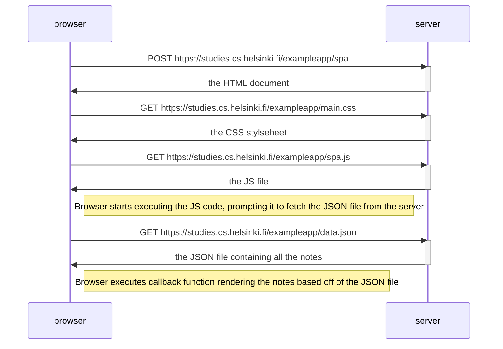

```mermaid
sequenceDiagram
    participant browser
    participant server

    browser->>server: POST https://studies.cs.helsinki.fi/exampleapp/spa
    activate server
    server ->> browser: the HTML document
    deactivate server

    browser->>server: GET https://studies.cs.helsinki.fi/exampleapp/main.css
    activate server
    server ->> browser: the CSS stylseheet
    deactivate server

    browser->>server: GET https://studies.cs.helsinki.fi/exampleapp/spa.js
    activate server
    server ->> browser: the JS file
    deactivate server

    Note right of browser: Browser starts executing the JS code, prompting it to fetch the JSON file from the server

    browser->>server: GET https://studies.cs.helsinki.fi/exampleapp/data.json
    activate server
    server ->> browser: the JSON file containing all the notes 
    deactivate server

    Note right of browser: Browser executes callback function rendering the notes based off of the JSON file
```