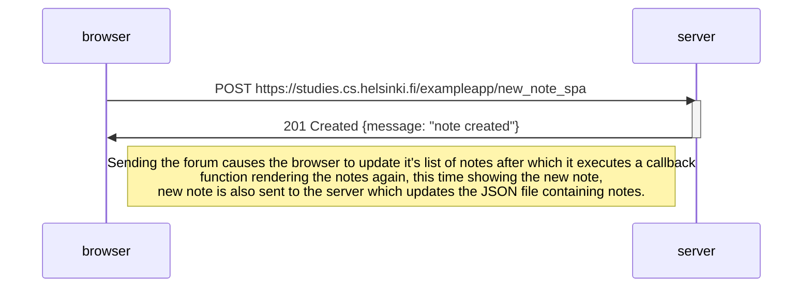

```mermaid
sequenceDiagram
    participant browser
    participant server
    
    browser->>server: POST https://studies.cs.helsinki.fi/exampleapp/new_note_spa
    activate server
    server ->> browser: 201 Created {message: "note created"}
    deactivate server
    
    Note right of browser: Sending the forum causes the browser to update it's list of notes after which it executes a callback <br> function rendering the notes again, this time showing the new note,<br> new note is also sent to the server which updates the JSON file containing notes. 
```